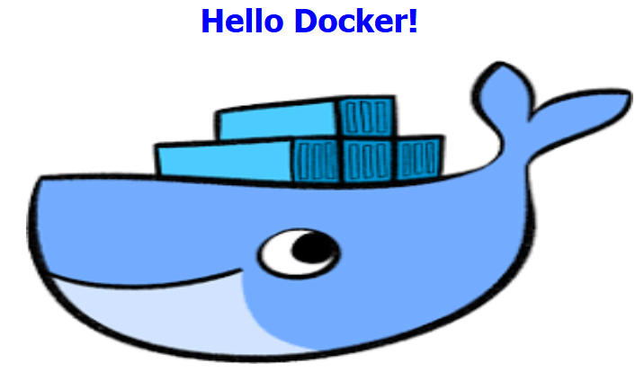

<p align="center">
  
</p>

<p align="center">
  <a href="https://github.com/harik8/hello-docker/actions/workflows/main.yaml">
    
  </a>
  
</p>

The hello-docker is a containerized web app, which serves a simple html page as shown above in the image.
It's useful for learning and testing purposes.  

# Usage

- Docker

```docker run -p 8080:80 harik8/hello-docker```

- Kubernetes

```kubectl run hello-docker --image=harik8/hello-docker --restart=Never```
